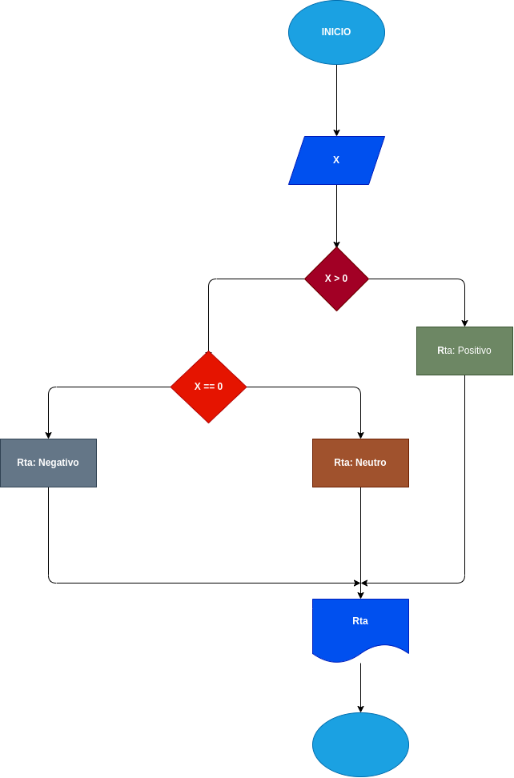

# Trabajo N°5

## programa paraverificar si un numero es positivo o es negativo

# ANALISIS

---

Variables de entrada (input)

X: Un numero que puede ser positivo o puede ser negativo

Variablesde proceso y salida (processing, storage, output)

X > 0: este sirve para identificar si el numero es positivo o tieneotravariante

X == 0: este sirve para diferenciar si el numeroes negativoo neutro

---

# DISEÑO

---

# CONSTRUCCION